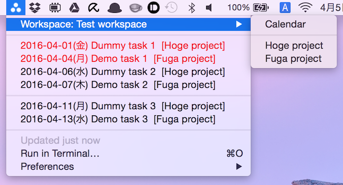
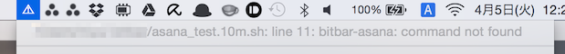

BitBar plugin for Asana
=======================

[BitBar](https://getbitbar.com/) plugin for Asana.
Displays the tasks that are assigned to you in the specified workspace

 


Requirement
-----------

* Node.js （Only tested with v4.4.2）


How to use
----------

### Install

```
$ [sudo] npm i -g umi-uyura/node-bitbar-asana
```

### Set your personal access token

* How to obtain a token, please look at [Personal Access Tokens](https://asana.com/guide/help/api/api#gl-access-tokens).
* Copy *example/bitbar_asana* to *$HOME/.bitbar_asana*
* Set personal access token to `BITBAR_ASANA_ACCESSTOKEN` in *$HOME/.bitbar_asana*


### Check assignee and workspace id

Use `bitbar-asana-me` command, to obtain information about the assignee and workspace.

```
$ bitbar-asana-me
ID of your name (dummy@example.com) is <assignee id>.
Workspace that belongs is as follows.
  Test workspace (<workspace id>)
  Lab workspace (<workspace id>)
```

Set the assignee and workspace information in *$HOME/.bitbar_asana*.

| Key | Value |
|---|---|
| `BITBAR_ASANA_ACCESSTOKEN` | Your personal access token |
| `BITBAR_ASANA_WORKSPACEID` | Workspace id of target |
| `BITBAR_ASANA_ASSIGNEE_ID` | Your assignee id |
| `BITBAR_ASANA_LANGUAGE` | *(optional)* Language settings when you display the day of the week |
| `BITBAR_ASANA_MENUBARICON` | *(optional)* Icon to be displayed in the menu bar. (Base64 encoded image) |


### Install BitBar plugin

* Copy *example/asana.10m.sh* to BitBar plugin folder
* Refresh Bitbar

Note
----

 

If the Node.js command can not be referenced from BitBar, please specify `bitbar-asana` command with full path in this file.

```
/path/to/bitbar-asana
```


Tips
----

### Multiple workspaces

* Copy *.bitbar_asana* other name (example *.bitbar\_asana\_other* )
* Copy *example/asana.10m.sh* to BitBar plugin folder with other name (example *asana_other.10m.sh* )
* Edit *asana_other.10m.sh*, add new .bitbar_asana_hogehoge
* Refresh Bitbar
